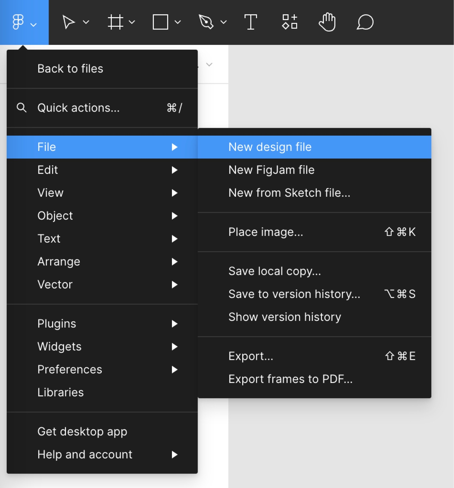

# Introduction to Design for Interaction
Course Code: IXD 5106

Academic Year: 2025-2026

Students will be introduced to design tools, processes, and best practices as they apply to web developers, content strategists, user experience designers, and creative technologists. The skills introduced in this course will be incorporated and reinforced in subsequent courses as part of the practice relevant to each discipline.

# Liinks
https://designlab.com/figma-101-course/introduction-to-figma

# Images

> **Note**: This repository provides essential skills in interaction design that will be applied in later courses. Make sure to review the design tools and best practices introduced here.

